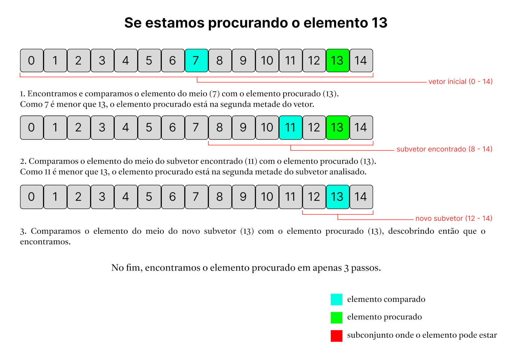
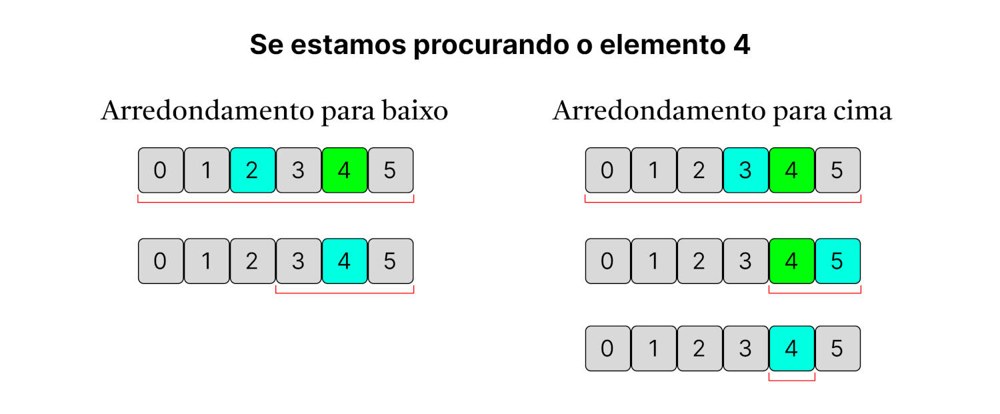
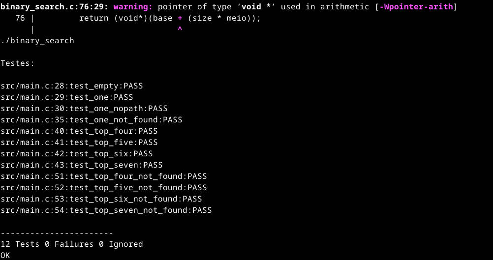
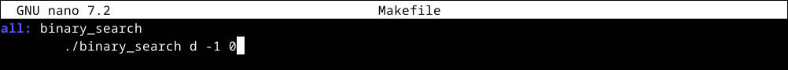
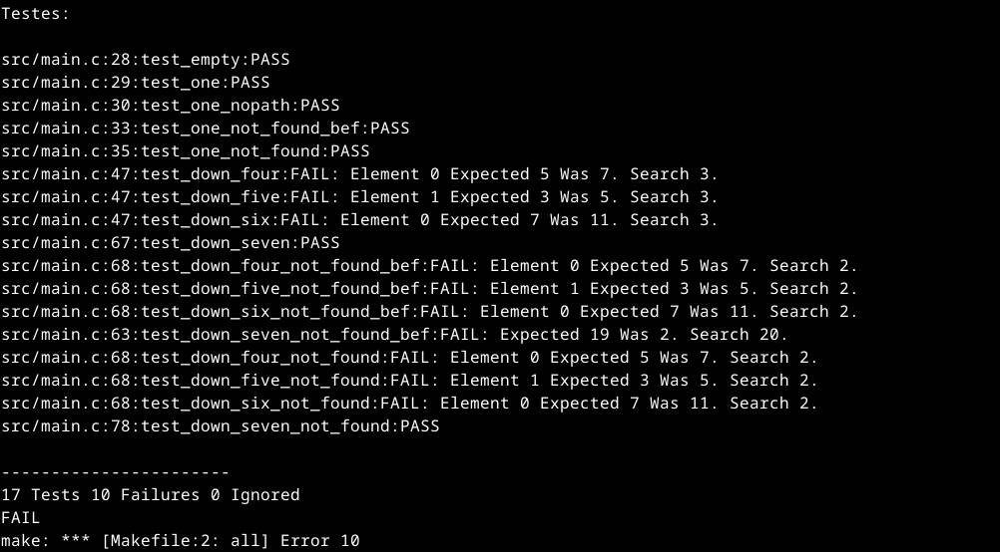
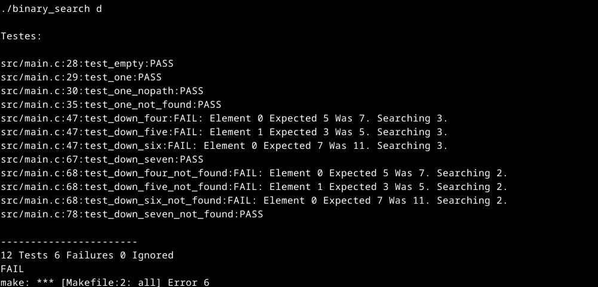
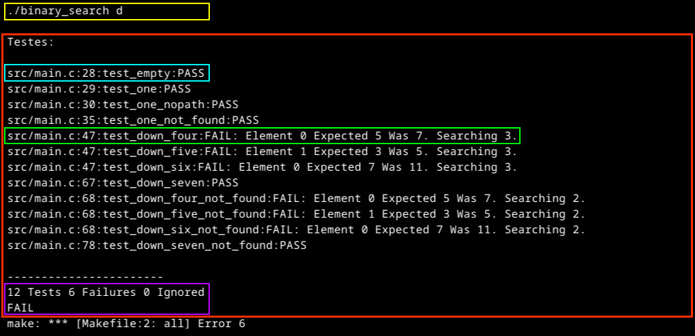
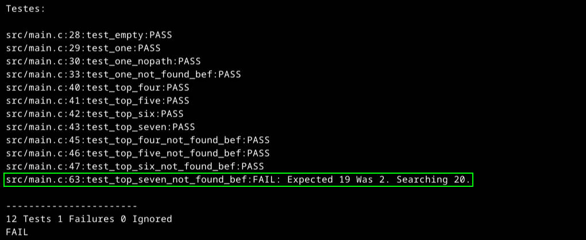

# Teste de Busca Binária

Esse programa foi criado com a intenção de ser uma base de testes para
 implementações da **_Busca Binária_** feitas utilizando a Linguagem C.

Quando o caminho até encontrar o elemento é importante, não só se ele
 está no vetor pesquisado ou não, a implementação da busca binária pode
 se tornar um tanto complexa. Não só isso, como a verificação se o
 código está executando como esperado pode não abranger todos os casos
 em que o algoritmo de fato será aplicado.

Os testes criados tentam englobar as diferentes possibilidades de
 execução da busca, verificando tanto se o elemento foi encontrado,
 quanto o caminho percorrido. Fornecendo uma interface simples e de
 fácil compreensão, para agilizar os testes e a validação da busca
 implementada.

:wrench: Esse projeto foi implementado utilizando o framework
 [Unity](https://github.com/ThrowTheSwitch/Unity/tree/master), que
 auxilia na criação de testes unitários construídos em C

:bangbang: _**Obs:**_ os testes criados consideram que o vetor
 processado é ordenado e não possui elementos repetidos.

## Preparando o código

Primeiramente faça um clone desse repositório em sua máquina. Utilizando
 o terminal essa operação pode ser feita executando o comando:

	git clone https://github.com/mutannejs/Teste_BSearch.git

Dentro da pasta do programa há um arquivo chamado **binary_search.c**, é
 neste arquivo que você deve escrever seu código da busca binária. Mais
 a frente há uma maior explicação sobre este processo, sobre o arquivo e
 a implementação do [algoritmo da busca](#o-algoritmo-da-busca-binária).

Após escrever o código da busca, ela já estará pronta para ser testada,
 mas antes é necessário se certificar de ter a ferramenta **make**
 instalada em seu sistema, ela será extremamente útil e necessária para
 agilizar a compilação do código e execução dos testes. Para saber se a
 ferramenta está presente no seu sistema você pode executar o comando a
 seguir em seu terminal:

	make -v

Outra ferramenta necessária é o **gcc**. Em sistemas Linux baseados em
 Debian esses dois programas podem ser instalados utilizando o comando:

	apt install build-essential

## O algoritmo da Busca Binária

Quando precisamos encontrar um dado específico dentro de um vetor,
 basicamente podemos realizar sua busca de duas maneiras diferentes, a
 partir de uma **busca linear** ou de uma **busca binária**.

Na busca linear, analisamos elemento por elemento, iniciando pelo
 primeiro índice do vetor, até encontrar o dado buscado, ou percorrer
 toda a estrutura. Essa abordagem pode não ser muito eficiente quando o
 vetor possui muitos elementos e aquele que está sendo buscado se
 encontra próximo ao último índice (ou está nesta posição).

Quando estamos trabalhando com um vetor ordenado, ao analisar um
 elemento qualquer sabemos de duas coisas: todos elementos em posições
 anteriores a ele são menores que ele (caso o vetor possa ter dados
 repetidos, os dados são menores ou iguais), e todos elementos em
 posições sucessoras são maiores que ele. A busca binária se aproveita
 desse fato e faz a busca pelo elemento apenas na parte do vetor que ele
 sabe que o dado está, analisando sempre o elemento que está na posição
 central daquele subconjunto (sendo o centro do vetor inicial a primeira
 posição analisada), para então continuar sua busca a partir dele. O
 algoritmo só para ao encontrar o dado buscado, ou quando não é
 possível dividir o subvetor em uma parte menor (o subconjunto é formado
 por apenas um elemento), ou seja, o dado não está no vetor.

Usando como exemplo um vetor de inteiro com 15 elementos, sendo o
 primeiro elemento igual a `0`, e os próximos elementos igual ao valor
 do elemento anterior incrementado em 1, se usássemos a busca binária
 para encontrar o elemento `13`, teríamos a seguinte execução:



Se usássemos busca linear para encontrar o dado, teríamos que percorrer
 elemento por elemento até chegar naquele com valor `13`, sendo
 necessário extamente 14 passos para encontrá-lo (11 a mais se usado
 busca binária).

### Arredondamentos

No exemplo mostrado, tanto o vetor inicial quanto os subvetores
 analisados durante a busca possuíam um número ímpar de elementos. Esse
 fato implica em existir apenas **um elemento** central no subconjunto
 analisado, porém, se por acaso fosse encontrado um subvetor com uma
 quantidade par de elementos, não existiria um elemento central
 explícito para analisar. Neste caso, poderíamos analisar os dois
 elementos mais próximos ao centro, onde essa escolha nada mais é que o
 **arredondamento** impregado em nosso algoritmo da busca binária.
 Observe:



No exemplo mostrado temos a representação da execução do algoritmo
 utilizando os dois tipos de arredondamento. Em ambas execuções a
 solução foi encontrada, porém, o caminho percorrido é diferente. Neste
 caso, o algoritmo com arredondamento para baixo chegou à solução em
 apenas dois passos, enquanto a outra implementação chegou à solução em
 três passos. Porém, isso não implica que utilizar arredondamento para
 baixo é a melhor escolha, em outros casos o arredondamento para cima
 poderia se sair melhor, não há uma escolha correta em qual
 arredondamento utilizar. Essa escolha pode depender da situação onde
 a busca binária será usada, ou apenas de qual é mais intuitiva de
 implementar.

## binary_search()

Dentro do arquivo **binary_search.c**, além da linha `#include
 "src/binary_search.h"`, existe apenas a declaração de uma função, sendo
 ela a função `binary_search()`, responsável pela lógica da
 _busca binária_. Seu protótipo é:

```
void* binary_search(const void *key, const void *base, size_t nintems, size_t size, int (*compar)(const void *, const void *), int *path, int ifnotfound);
```

A função `binary_search()` já possui sua interface definida, por tanto,
 é importante que o corpo da função obedeça a seus parâmetros para que
 os testes possam ser executados com êxito. Para isso, é importante
 entender o significado de cada parâmetro, como também de seu retorno.

Referente aos argumentos, comparando com a função **bsearch()**
 encontrada na biblioteca padrão C e outras implementações encontradas
 pela internet, a função binary_search() presente nesse programa, possui
 dois argumentos a mais, **\*path** e **\*ifnotfound**, os quais
 permitem visualizar o caminho percorrido e retornar elementos
 alternativos caso o procurado não tenha sido encontrado, ambas
 características que não estão presentes na bsearch().

Os argumentos da binary_search():

- **\*key** : esse ponteiro aponta para a chave usada na busca, ou seja,
 o elemento procurado deve possuir seu atributo chave igual ao valor de
 `\*key`.

- **\*base** : esse ponteiro aponta para o vetor onde a busca será
 feita. Lembrando que esse vetor deve estar ordenado.

- **nitems** : esse inteiro informa a quantidade de elementos que o
 vetor possui.

- **size** : é o tamanho em memória que os dados indexados pelo vetor
 `base` ocupam, normalmente pode-se usar a função `sizeof()` para
 encontrar este valor.

- **\*compar** : esse ponteiro define a função que será usada para
 comparar os elementos do vetor. Essa função deve receber dois
 argumentos do tipo `const void *`, onde o primeiro argumento representa
 o ponteiro `key`, e o segundo receberá o endereço do elemento do vetor
 que será comparado. A função deve retornar um inteiro negativo caso
 `key` seja menor que o elemento passado no segundo argumento, um
 inteiro positivo caso `key` seja maior, ou zero caso eles sejam iguais.

- **\*path** : esse ponteiro representa o caminho processado pelo
 algoritmo até chegar na solução. Ele pode ser igual a `NULL`, indicando
 que o caminho para chegar à solução não é necessário (neste caso,
 `path` não deve ser manipulado), ou ser o endereço de um vetor de
 inteiros pré alocado, onde na primeira posição do vetor deve ser
 armazenado o valor do primeiro elemento processado na busca, na segunda
 posição do vetor armazenado o valor do segundo elemento processado na
 busca, e assim por diante.

- **ifnotfound** : esse inteiro informa qual deve ser o retorno da
 função caso o elemento buscado não seja encontrado. `ifnotfound` pode
 assumir os três valores:
 
	- -1 : deve ser retornado o maior elemento detre aqueles com o
	 atributo chave menores que o valor de `key`;
	- 0 : deve ser retornado `NULL`;
	- 1 : deve ser retornado o menor elemento detre aqueles com o
	 atributo chave maoires que o valor de `key`.

- o **retorno** da função, nada mais é que o endereço do elemento
 procurado. Porém a função deve retornar `NULL` caso ocorra algum dos
 três casos:

	- o elemento não foi encontrado e `ifnotfound` é igual a 0;
	- o elemento não foi encontrado, `ifnotfound` é igual a -1 e o valor
	 de `\*key` é menor que o valor do atributo chave do primeiro
	 elemento dentro do vetor;
	- o elemento não foi encontrado, `ifnotfound` é igual a 1 e o valor
	 de `\*key` é maior que o valor do atributo chave do último elemento
	 dentro do vetor.

Um _exemplo_ do uso dessa função seria:

```
/* consirando que a função de comparação possui o nome comp_int e já
 tenja sido implementada em outro local */

int v[] = {3, 5, 7, 11};
int caminho[4];
int chave = 4;

int *ret = binary_search(&chave, v, 4, sizoef(int), comp_int, caminho, 0);

if (ret == NULL) {
	printf("O elemento %d não está presente no vetor", chave);
}
else {
	printf("O elemento %d está no vetor", chave);
}

```

## Execução dos testes

Após escrever o código da busca binária, para compilar o programa e
 executar os testes básicos em seguida deve-se rodar o comando:

	make



Na saída do comando podemos ter acesso aos erros encontrados durante a
 compilação, e logo em seguida o resultado da execução dos testes
 básicos.

Por padrão, a maioria dos testes executados consideram que o algoritmo
 da busca utiliza **arredondamento para cima** (mais a frente há uma
 explicação sobre os dois tipos de [arredondamentos](#arredondamentos)
 possíveis), por tanto, se seu código foi implementado utilizando
 arredondamento para baixo, não precisa se preocupar caso os testes
 retornem falha (mais a frente também há uma explicação de como
 [interpretar](#interpretando-as-saídas-dos-testes) o resultado dos
 testes). Além de considerar que foi utilizado arredondamento para cima,
 são executados apenas testes que encontram o elemento buscado, ou que
 retornam `NULL` por não encontrá-lo.

Após cada alteração no código é necessário utilizar o comando `make`
 novamente. Porém, se o teste que você deseja realizar não faz parte
 daqueles feitos ao rodar o comando, será necessário executar o arquivo
 `binary_search`, criado com a compilação do código. A escolha dos
 testes a realizar é feita a partir da combinação de argumentos passados
 na execução do programa, possuindo como possíveis valores as opções
 listadas a baixo:

- Referentes ao tipo de arredondamento utilizado (caso ambos valores
 sejam passados, o último será o considerado)
	- **t** : executa os testes com arredondamento para cima;
	- **d** : executa os testes com arredondamento para baixo.

- Referentes ao retorno da função caso o elemento buscado não seja
 encontrado (pode-se usar mais que um)
	- **-1** : executa os testes que retornam o maior elemento detre
	aqueles com o atributo chave menores que o valor de `key`;
	- **0** : executa os testes que retornam `NULL`;
	- **1** : executa os testes que retornam o menor elemento detre
	aqueles com o atributo chave maoires que o valor de `key`;
	- **2** : executa todos os três tipos de testes anteriores.

**Por exemplo:** caso você tenha implementado sua busca binária com
 arredondamento para baixo, e pretenda utilizá-la em duas situações
 diferentes, uma onde caso não encontrado o elemento buscado seja
 necessário retornar o maior elemento detre os menores que ele, e na
 outra onde caso o elemento buscado não seja encontrado não deva-se
 retornar nenhum outro em seu lugar, uma possível execução do programa
 para esse exemplo seria:

	./binary_search d -1 0

Assim, os testes para as situações consideradas, e apenas eles, seriam
 realizados.

### Dica

Se durante o desenvolvimento da busca binária, os testes que você queira
 que sejam realizados sejam sempre os mesmos, você pode alterar a
 segunda linha do arquivo `Makefile`, acrescentando a passagem de
 argumentos na execução do programa, assim, todos os testes (além da
 compilação do código há cada mudança nele) já serão executados ao
 utilizar o comando `make`.

Fazendo essa alteração a partir do editor de textos nano:



Executando novamente o comando `make`:



Na saída podemos ver que vários erros foram encontrados durante os
 testes, porém, isso já era esperado, pois o algoritmo que estava sendo
 usado ao executar o `make` utiliza arredondamento para cima. Também é
 importante mencionar que, embora a execução do `make` tenha
 retornado erros, esses 10 erros são referentes aos testes da busca
 binária que falharam.

## Motivo dos testes

Para interpretar o resultados dos testes, antes é necessário entender o
 motivo da criação deles, o que cada um deles vai testar de especial.
 Em geral eles testam quando ocorre e quando não ocorre arredondamento
 na execução do código, em outras palavras, quando o subvetor a ser
 analisado possui uma quantidade par e quando possui uma quantidade
 ímpar de elementos. Considerando também a sequência em que ambas
 possiblidades ocorrem.

### Testes para casos especiais

- **test_empty** : quando é feito a busca em um vetor com zero
 elementos. A busca deve retornar `NULL` e o vetor **\*path** não deve
 ser alterado ;
- **test_one** : quando há apenas um elemento no vetor. A busca deve
 retornar o elemento e apenas ele deve fazer parte do vetor **\*path**;
- **test_one_nopath** : quando há apenas um elemento no vetor. A busca
 deve retornar o elemento mas não deve manipular o vetor **\*path**;

### Testes onde o arredondamento é importante

Alguns testes abaixo podem se comportar de maneira semelhante dependendo
 do elemento procurado, mas a descrição deles informa o que eles tem
 como diferença principal. Além disso, as características citadas não
 levam em consideração quando o subvetor analisado possui apenas um
 elemento.

- **test_top_four** : para encontrar o elemento, a busca realiza
 dois arredondamentos consecutivos; 
- **test_top_five** : para encontrar o elemento, a busca primeiramente
 compara o elemento no centro do vetor, e depois realiza um
 arredondamento;
- **test_top_six** : para encontrar o elemento, a busca primeiramente
 faz um arredondamento e em seguida compara apenas elementos que estão
 no centro dos subvetores encontrados;
- **test_top_seven** : para encontrar o elemento, a busca apenas compara
 elementos que estão no centro do conjunto analisado;

Assim, com todos os testes mencionado é possível saber se a busca está:

- se comportando corretamente para vetores:
	- vazios;
	- com apenas um elemento;
	- com vários elementos;
- se comportando corretamente quando:
	- é realizado dois ou mais arredondamentos em seguida;
	- é realizado um arredondamento logo após a comparação de um
	 elemento de centro;
	- é comparado um elemento de centro logo após a realização de um
	 arredondamento;
	- não ocorre arredondamentos, apenas é feita a comparação de vários
	 elementos de centro em seguida.

Embora os testes mencionados realizem apenas arredondamento para cima,
 os testes com arredondamento para baixo se comportaram de maneira
 igual.

Agora, em relação aos testes que não encontram o elemento prcurado,
 podemos saber se a busca binária se comporta corretamente quando é
 esperado que:

- ela encontre o maior elemento detre aqueles com o atributo chave
 menores que o valor de `key`;
- ela encontre o menor elemento detre aqueles com o atributo chave
 maiores que o valor de `key`;
- seja retornado `NULL` quando não é possível retornar um elemento menor
 que o elemento procurado;
- seja retornado `NULL` quando não é possível retornar um elemento maior
 que o elemento procurado;

## Interpretando as saídas dos testes

Primeiramente vamos utilizar como exemplo a saída a baixo, gerada a
 partir da execução do comando `make` com o arquivo Makefile alterado
 para realizar os testes com arredondamento para baixo:



Nessa saída não é possível ver os erros ou avisos de compilação, que
 são mostrados antes da primeira linha da saída. Do que a imagem possui,
 devemos dar atenção às seguintes informações:



Demarcado em amarelo, temos o comando usado para executar o
 `binary_search`, o mesmo comando presente na segunda linha do
 `Makefile`.

Em vermelho temos toda a saída referente aos testes, gerada
 exclusivamente a partir do uso do framework
 [Unity](https://github.com/ThrowTheSwitch/Unity/tree/master), sendo o
 resultado dos testes cada uma das linhas começada com `src/main.c`,
 onde temos entre os caracteres `:` alguma informação sobre o teste
 específico. Usando como exemplo o primeiro resultado (demarcado em
 azul) temos:

- `src/main.c` : é o arquivo onde a chamada do teste está, no caso,
 todos os testes são chamados no arquivo main.c, dentro da pasta src;
- `28` : a linha onde o teste foi chamado;
- `test_empty` : o nome do teste;
- `PASS` : o resultado do teste, nesse caso significa que a busca
 binária implementada passou no teste;

Demarcado em roxo temos o total de testes realizados, seguido pelo total
 de testes que apresentaram falha e pelo total de testes que foram
 ignorados (na implementação desse projeto nenhum teste foi configurado
 para ser ignorado, independentemente dos argumentos passados na
 execução de `.binary_search`).

Por fim, tanto na imagem a cima, quanto na imagem de baixo, temos linhas
 demarcadas em verde, essas são linhas que retornaram falha. Por tanto,
 no lugar de `PASS`, como na linha demarcada em azul, há a palavra
 `FAIL`, e após dela, temos a descrição da falha.



Ao combinar o **nome do teste** com a **descrição da falha**, obtemos a
 melhor indicação do motivo de seu ocorrimento. Mas antes, é necessário
 entender no que consiste um teste.

### Como funciona um teste

Os...

### Nome do teste

Todos os testes possuem a descrição do que fazem em seu nome.

Em geral, todos os testes tem seu nome iniciado com a palavra `test`
 seguido da palavra `top` ou `down`, inidicando qual tipo de
 arredondamento será considerado, arredondamento para baixo (down) ou
 arredondamento para cima (top).

Depois, temos no nome algum número em formato texto (one, four, five,
 six ou seven), indicando quantos elementos o vetor onde é feito a busca
 possui. Alguns testes tem seu nome terminado por esse número, sendo
 esses, testes onde o elemento procurado está presente no vetor.

Os testes que possuem mais informação, ou seja, os testes onde o
 elemento procurado não está no vetor, possuem após a informação da
 quantidade de elementos, as palavras `not_found`, e após elas, podem ou
 não ter a palavra `bef` (de before) ou a palavra `next`.

- Caso o nome do teste termine em `not_found`, significa que na execução
 da função `binary_search()` será passado para o argumento `ifnotfound`
 o valor `0`;
- Caso o nome termine em `bef`, significa que foi passado para o
 argumento `ifnotfound` o valor `-1`;
- Caso o nome termine em `next`, significa que foi passado para o
 argumento `ifnotfound` o valor `1`,

Por fim, temos três testes que não seguem esse padrão, e que são
 sempre executados, são eles:

- test_empty : testa a busca para um vetor vazio;
- test_one : testa a busca para um vetor com apenas um elemento, o mesmo
 que está sendo procurado;
- test_one_nopath : igual ao de cima, mas na execução da
 `binary_search()` passa o valor `NULL` para o argumento `\*path`,
 indicando que não deve-se retornar o caminho percorrido.

Por exemplo, o teste `test_top_five_not_found_bef` testa a busca binária
 implementada com arredondamento para cima utilizando um vetor de cinco
 elementos, onde o elemento procurado não está presente, sendo esperado
 que ao não encontrar seja retornado o maior elemento detre aqueles com
 o atributo chave menores que o valor de `key`. O teste
 `test_down_seven_not_found_next` por sua vez, testa a busca binária
 implementada com arredondamento para baixo ultilizando um vetor de sete
 elementos, onde o elemento procurado não está presente, sendo esperado
 que ao não encontrá-lo seja retornado o menor elemento detre aqueles
 com o atributo chave maoires que o valor de `key`.

### Decrição da falha

## A fazer

- [X] testes padrões
- [X] testes com arredondamento para cima
	- [X] encontrados
	- [X] não encontrados retornando NULL
	- [X] não encontrados retornando o predecessor
	- [X] não encontrados retornando o sucessor
- [X] testes com arredondamento para baixo
	- [X] encontrados
	- [X] não encontrados retornando NULL
	- [X] não encontrados retornando o predecessor
	- [X] não encontrados retornando o sucessor
- [X] criar testes com mensagens
- [ ] melhorar mensagens nos testes
- [X] permitir maior interação com o que o usuário deseja testar
- [X] facilitar interação com o usuário
- [ ] escrever o readme
	- [X] descrever o funcionamento da busca binária
	- [X] descrever como executar o programa
	- [ ] descrever como analisar os erros encontrados
	- [X] descrever o motivo de cada teste
- [ ] criar arquivo explicando como cada teste funciona
